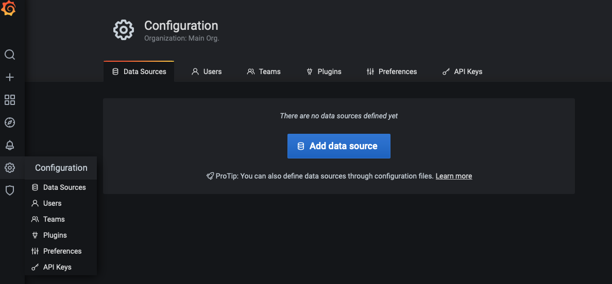

# Minimal Telegraf InfluxDB Grafana (TIG) stack
Version 0.1.0

## Features  
Hardware usage metrics (cpu, disk) are collected from local host by __telegraf__ and stored in __InfluxDB__.
__Grafana__ can be used for data visualisation.  

## Components  
  
- telegraf
- InfluxDB
- Grafana

## Configuration
### Services launch
```Bash
docker compose -f docker-compose.yml up -d
```  

###  Grafana login  
Open your browser at [http://127.0.0.1:3001](http://127.0.0.1:3001), use admin admin for user/password on grafana login. You can optionally change password, otherwise just press "skip".

### Add InfluxDB source:  

Select "Configuration" -> "Data Source" or blue button "Data Source"  
  * connector type: InfluxDB
  * URL: http://influxdb:8086
  * database: telegraf

At the bottom of the page, select "Save & Test" button.

### Configure a new dashboard
